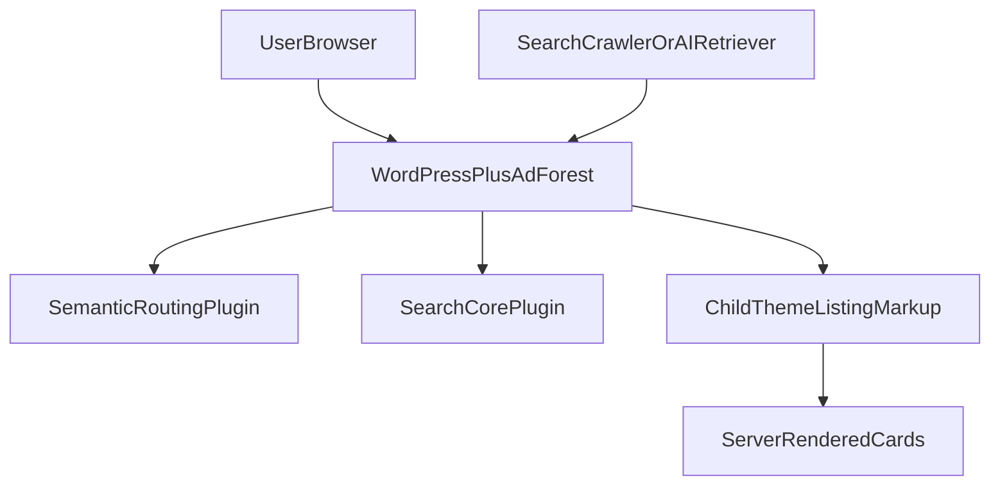
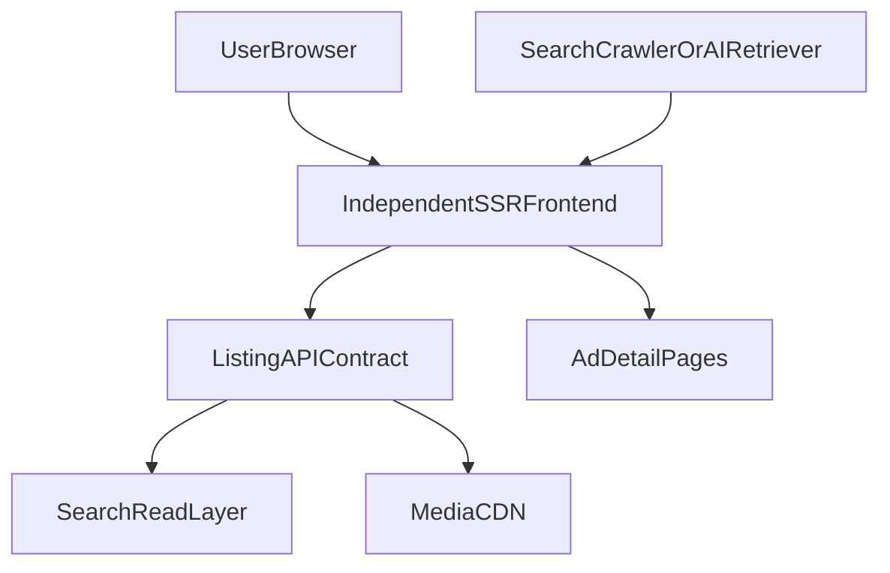

# Architecture: Current vs Target

## Current

Characteristics:
- listing HTML is still rendered by WordPress
- semantic routing already lives in plugin code
- URL policy and search helpers are partially decoupled from the theme
- card presentation is still child-theme owned

## Target

Characteristics:
- frontend becomes independent from WordPress runtime
- listing data is consumed through a stable contract
- semantic URL ownership remains stable
- infinite scroll remains only an enhancement layer

## Bridge State After This Phase
After this phase, the project is in a bridge state:

- URL policy is tighter and more deterministic
- listing data contract exists in plugin form
- documentation for migration is now inside the repository
- final rendering is still WordPress-owned

## What Still Makes The Current System Non-Independent
- child-theme card templates
- AdForest search query/render pipeline
- theme-owned long-scroll UI behavior

## What Is Ready For The Next Phase
- consuming listing data through REST
- route-by-route frontend replacement
- migration tracking without reconstructing architecture intent
